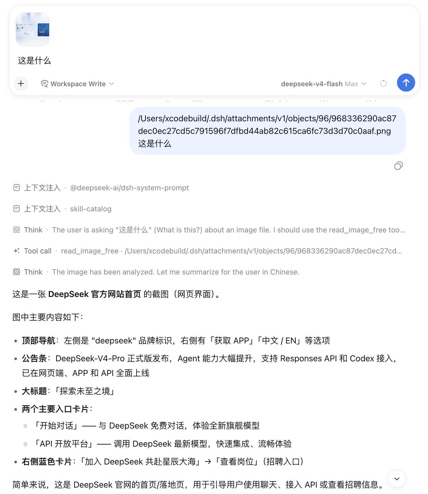

# dsh-plugin-read-image-free

dsh web 插件：让模型理解图片内容 —— 使用 [bigmodel.cn](https://bigmodel.cn/apikey/platform) 提供的免费 vision 模型（GLM-4.1V-Thinking-Flash）进行 OCR、画面描述、图内文字翻译等，对不支持图片输入的模型同样可用。

插件会注册一个 `read_image_free` 工具，模型直接传图片路径即可调用。多条图片路径之间以空格分隔，避免黏连成 `/a.png/b.png`。

## 效果



## 配置

免费申请 key：https://bigmodel.cn/apikey/platform

## 安装

```bash
cd ~/.dsh/profiles/web
pnpm add dsh-plugin-read-image-free
```

`cordis.patch.yml` 追加：

```yaml
- insert:
    - id: read-image-free
      name: 'dsh-plugin-read-image-free'
      config:
        # apiKey: '你的智谱KEY'   # 可选；不填则读环境变量 / config.json
```

> 升级插件：`pnpm update dsh-plugin-read-image-free` 后重启 dsh web 生效。
> 本地开发调试时，也可用 `file:/Users/xcodebuild/code/dsh-plugin-read-image-free` 或文件 URL + `?v=` 递增方式安装，可热加载无需重启。

## 卸载

```bash
cd ~/.dsh/profiles/web
pnpm remove dsh-plugin-read-image-free
# 从 cordis.patch.yml 删除对应 insert 行
```
